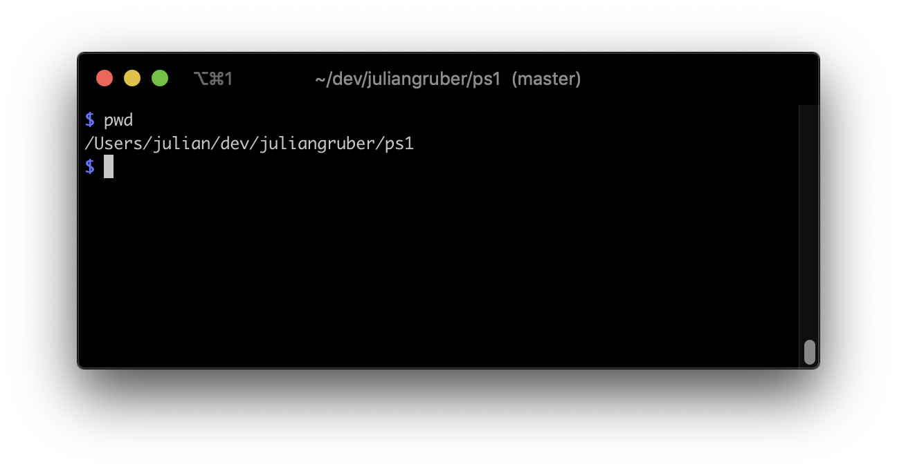

# ps1

  A minimal PS1 with git branch support.

  

  - The PS1 is always `$`, so terminal output can easily be copied into documentation without having to reformat for pretty output
  - Using `PROMPT_COMMAND`, a feature supported by [iTerm2](https://iterm2.com/) and probably other terminal emulators, the `cwd` and `git` branch are always displayed in the tab header

## Installation

Bash:

```bash
$ source ps1.sh
```

Zsh:

```zsh
$ source ps1.zsh
```

## License

MIT
